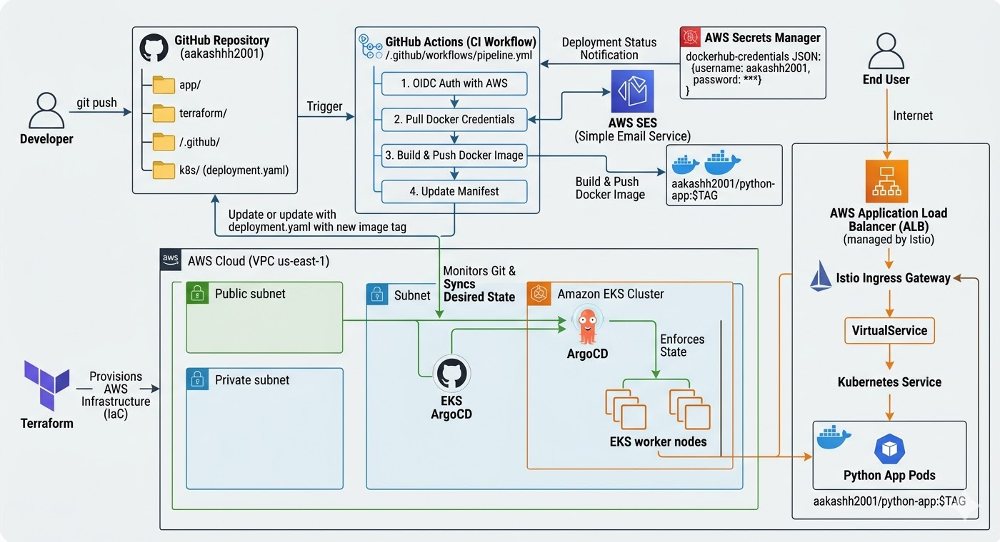

# Cloud-Native GitOps Platform on AWS EKS with Istio & ArgoCD



## 🚀 Project Overview
This project demonstrates a fully automated, production-ready Continuous Integration and Continuous Deployment (CI/CD) pipeline using the **GitOps** methodology. It provisions a highly available Kubernetes cluster on AWS using Infrastructure as Code (IaC) and automates the deployment of a Python application. 

The architecture enforces security best practices, dynamic secret retrieval, and automated traffic management, ensuring that the GitHub repository acts as the single source of truth for both the application code and the infrastructure state.

## 🛠️ Tech Stack & Architecture
* **Cloud Provider:** Amazon Web Services (AWS)
* **Infrastructure as Code (IaC):** Terraform (VPC, Subnets, EKS, IAM)
* **Container Orchestration:** Amazon EKS (Elastic Kubernetes Service)
* **Continuous Integration (CI):** GitHub Actions
* **Continuous Deployment (CD):** ArgoCD
* **Service Mesh / Ingress:** Istio
* **Containerization:** Docker & Docker Hub
* **Secret Management:** AWS Secrets Manager
* **Notifications:** AWS Simple Email Service (SES)

## 🏗️ Core Architecture Flow
1. **Developer Push:** Code is committed to the `main` branch of the GitHub repository.
2. **CI Pipeline (GitHub Actions):** * Authenticates securely with AWS via OIDC.
   * Retrieves Docker Hub credentials (`aakashh2001`) dynamically from AWS Secrets Manager.
   * Builds the Python Docker image and pushes it to Docker Hub with a unique short-SHA tag.
   * Automatically updates the Kubernetes `deployment.yaml` manifest with the new image tag and pushes the commit back to GitHub (`aakashhh2001`).
3. **CD Pipeline (ArgoCD):** * Detects the drift in the GitHub repository.
   * Automatically synchronizes the AWS EKS cluster to match the desired state defined in Git.
4. **Traffic Management:** Istio Ingress Gateway intercepts traffic from the AWS Application Load Balancer and routes it to the Python application pods via VirtualServices.
5. **Notification:** AWS SES sends an automated email (`ramanan11032026@gmail.com`) confirming the successful deployment.

## 💡 Key Features & Engineering Decisions
* **Zero-Touch Secrets:** No sensitive data or tokens are hardcoded. Passwords are injected at runtime using AWS Secrets Manager and temporary environment variables.
* **Idempotent CI Updates:** The pipeline utilizes a smart `git diff` check to ensure the workflow only creates a new commit if the Docker image tag has actually changed, preventing endless loop failures.
* **Automated Rollbacks:** Because ArgoCD constantly monitors the cluster, any manual, unauthorized `kubectl` changes made directly to the cluster are instantly overwritten to match the Git repository state.

## ⚙️ Step-by-Step Implementation

### 1. Infrastructure Provisioning
Navigate to the `terraform/` directory to deploy the base AWS infrastructure.
```bash
cd terraform
terraform init
terraform apply --auto-approve
aws eks update-kubeconfig --region us-east-1 --name <cluster-name>
```

### 2. Service Mesh & GitOps Setup
Install Istio for traffic management and ArgoCD for continuous deployment.
```bash
# Install ArgoCD in the cluster
kubectl create namespace argocd
kubectl apply -n argocd -f [https://raw.githubusercontent.com/argoproj/argo-cd/stable/manifests/install.yaml](https://raw.githubusercontent.com/argoproj/argo-cd/stable/manifests/install.yaml)

# Access the ArgoCD UI
kubectl port-forward svc/argocd-server -n argocd 8080:443
```
Configure a new ArgoCD Application pointing to the `k8s/` directory in this repository.

### 3. CI/CD Automation
The CI pipeline is defined in `.github/workflows/pipeline.yml`. It requires the following setup:
* An AWS IAM Role configured with OIDC trust for GitHub Actions.
* An AWS Secret named `dockerhub-credentials` containing `username` and `password` keys.

## 🐛 Troubleshooting & Lessons Learned
During the development of this platform, several real-world DevOps challenges were resolved:
* **EKS Load Balancer Orphaned Resources:** Encountered AWS `DependencyViolation` errors during `terraform destroy`. This was resolved by documenting a teardown procedure to manually delete the Kubernetes-generated ALB and Target Groups before running the Terraform destroy command, as Terraform does not track resources created natively by the Kubernetes cloud-controller-manager.
* **ImagePullBackOff & Syntax Enforcement:** Resolved pod startup failures by enforcing strict lowercase naming conventions for Docker images in the Kubernetes manifests and ensuring the CI pipeline successfully pushed the image *before* the CD pipeline attempted to pull it.
* **ArgoCD Resource Tug-of-War:** Handled `SharedResourceWarning` alerts by ensuring strict 1-to-1 mapping between ArgoCD applications and Kubernetes namespaces, utilizing non-cascading deletion policies to safely migrate management states without cluster downtime.
